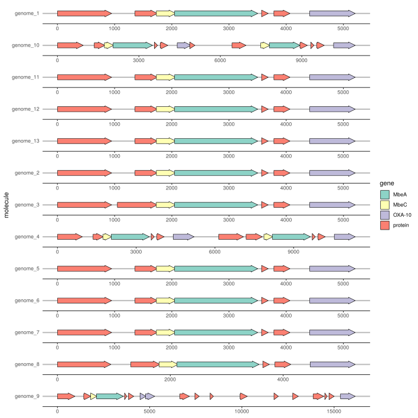
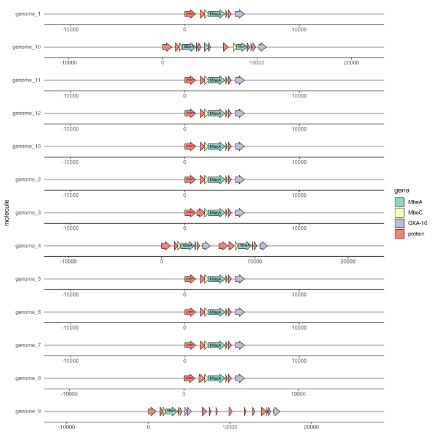

```{r setup, include=FALSE}
knitr::opts_chunk$set(echo = TRUE)
```

### Tutorial to visualize prokka output using gggenes package

Let us see how to visualize prokka data. Let's have **fun**.

I hope you already ran prokka on your genomes using following commands

```
% prokka genome.fasta --outdir prokka_out --prefix genome
```
If you have multiple genomes, you can loop prokka:

```
% for d in $(ls *.fasta);
  do 
  echo $d; prokka "$d" --outdir "$d"_prokka_out --prefix "$d" --centre X --compliant;
  done

```
make **gggenes** suitable format from prokka output
```
% grep "" */*.gff | fgrep 'CDS' \|
  awk '{print $1,$4,$5,$3,$7,$NF}' \|
  sed 's/;.*//g' \|
  sed 's/.fasta_prokka_out\/genome.*_1//g' \|
  sed -i 's/ + / 1 /g' \|
  sed -i 's/ - / -1 /g' >coordinates_files.gff
```
Lets jump into **R** from here

```{r chunk1}
setwd("/home/datta/Desktop/CPE/ProkkaVis")
#getwd()
#files()
```

Let us load the **coordinates_files.gff** into a dataframe
```{r chunk2}
coords <- read.table("coordinates_files.gff",header = FALSE, sep = " ")
head(coords)
```

Let us add the headers for the dataframe 

```{r chunk3}
#names(coords) <- c("genome","start","end","source","frame","cds")
names(coords) <- c("molecule","start","end","source","direction","gene")
head(coords)
coords2 <- within(coords, rm(source))
coords2$strand[coords$direction=="1"] <- "forward"
coords2$strand[coords$direction=="-1"] <- "reverse"
head(coords2)
```

Time to visualize. Lets load **gggenes** & **ggplot2** package
```{r chunk4}
library(gggenes)
library(ggplot2)
ggplot(subset(coords2, molecule == "genome_9"),
       aes(xmin = start, xmax = end, y = molecule, fill = gene, forward = direction)) +
  geom_gene_arrow()

```

Lets now draw multiple genomes in the plot
```{r chunk5}
#head(coords)
p <- ggplot(coords2, aes(xmin = start, xmax = end, y = molecule, fill = gene)) 
p + geom_gene_arrow() + facet_wrap(~ molecule, scales = "free", ncol = 1) + scale_fill_brewer(palette = "Set3") +
  theme_classic(base_size = 3)
```

But this does not look so elegant. And without the classic theme, there is constantly error call in R because of the size fonts.

```
Error in grid.Call(C_convert, x, as.integer(whatfrom), as.integer(whatto)...
```
So, we save the plot in a svg file using ggsave command

```{r chunk 6}
q <- ggplot(coords2, aes(xmin = start, xmax = end, y = molecule, fill = gene)) +  geom_gene_arrow() + facet_wrap(~ molecule, scales = "free", ncol = 1) + scale_fill_brewer(palette = "Set3")

ggsave("pic1_gnome_warrows.svg", plot = q, device = svg, width = 250, height = 250, units = "mm", dpi=300)
#ggsave("pic1_gnome_warrows.png", plot = q, device = png, width = 2000, height = 2000, units = "mm", dpi=30)
#ggsave("pic1_gnome_warrows.jpeg", plot = q, device = jpeg, limitsize = FALSE)

```       

The same above plots saved as svg file using ggsave generates a more elegant plot like this one below:

```{r chunk 7, out.width='60%'}
knitr::include_graphics("pic1_gnome_warrows.svg")
```

## Beautifying the plot with theme_genes()
Because the resulting plot look a bit cluttered, a ‘ggplot2’ theme **theme_genes()** is provided with some sensible defaults.

```{r chunk 8, out.width='60%'}
q2 <-  ggplot(coords2, aes(xmin = start, xmax = end, y = molecule, fill = gene)) +  geom_gene_arrow() + facet_wrap(~ molecule, scales = "free", ncol = 1) + scale_fill_brewer(palette = "Set3") + theme_genes()

ggsave("pic2_gnome_warrows_lessclutter.svg", plot = q2, device = svg, width = 250, height = 250, units = "mm", dpi=300)


```

### Aligning OXA-10 genes across facets using  make_alignment_dummies()

With that done, sometimes we need to vertically align a gene across the genomes. This could be easily achieved by make_alignment_dummies(). make_alignment_dummies() generates a set of ‘dummy’ genes that if added to the plot with ggplot2::geom_blank() will extend the range of each facet to visually align the selected gene across facets. Lets see how that works!

```{r chunk 9, out.width='60%'}
dummies <- make_alignment_dummies(
  coords2,
  aes(xmin = start, xmax = end, y = molecule, id = gene),
  on = "OXA-10"
)

q3 <-  ggplot(coords2, aes(xmin = start, xmax = end, y = molecule, fill = gene)) +  geom_gene_arrow() + geom_blank(data = dummies) + facet_wrap(~ molecule, scales = "free", ncol = 1) + scale_fill_brewer(palette = "Set3") + theme_genes()

ggsave("pic3_gnomes_aligned_byGene.svg", plot = q2, device = svg, width = 250, height = 250, units = "mm", dpi=300)

knitr::include_graphics("pic3_gnomes_aligned_byGene.svg")

```

### Labelling genes with geom_gene_label()

To label individual genes, let us provide a label aesthetic and use geom_gene_label(). 

```{r chunk 10, out.width='60%'}
q4 <- ggplot(coords2, aes(xmin = start, xmax = end, y =molecule, fill = gene, label = gene)) +
  geom_gene_arrow(arrowhead_height = unit(5, "mm"), arrowhead_width = unit(3, "mm")) +
  geom_gene_label(align = "left") +
  geom_blank(data = dummies) +
  facet_wrap(~ molecule, scales = "free", ncol = 1) +
  scale_fill_brewer(palette = "Set3") +
  theme_genes()

ggsave("pic4_labelarrows_wgeneNames.svg", plot = q4, device = svg, width = 250, height = 250, units = "mm", dpi=300)



```

Directionality to the gene arrows


```{r chunk 11, out.width='60%'}
#head(coords2)
q5 <- ggplot(coords2, aes(xmin = start, xmax = end, y = molecule, fill = gene, label= gene, forward = direction)) +
  geom_gene_arrow(arrowhead_height = unit(5, "mm"), arrowhead_width = unit(3, "mm")) +
  geom_gene_label(align = "left") + facet_wrap(~ molecule, scales = "free", ncol = 1) +
  scale_fill_brewer(palette = "Set3") +
  theme_genes()

ggsave("pic5_labelarrows_wgeneNames_strand.svg", plot = q5, device = svg, width = 250, height = 250, units = "mm", dpi=300)

knitr::include_graphics("pic5_labelarrows_wgeneNames_strand.svg")

```


### Problems I encountered
1) loading the image in the html. So, I had to save the figures using ggsave in svg format. Specifically svg format because png, jpeg 's width & height even after increasing did not generate the required image format like svg image file

2) After generating, I have loaded the svg images using knitr::include_graphics. This works well if the output is knitr html. But for knitr pdf, this did not work. So, I was left with 0creating the html output option

3) To generate a pdf from html file, I used pandoc. This would generate a nice pdf in latex. But, the code and figure are cut off on the right side if excceeds the page width. So far, could not find fix for this.