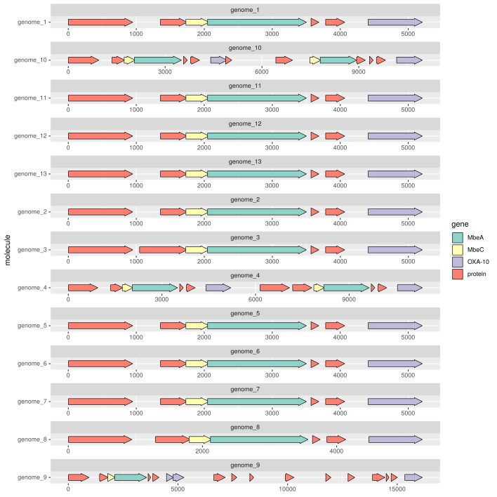
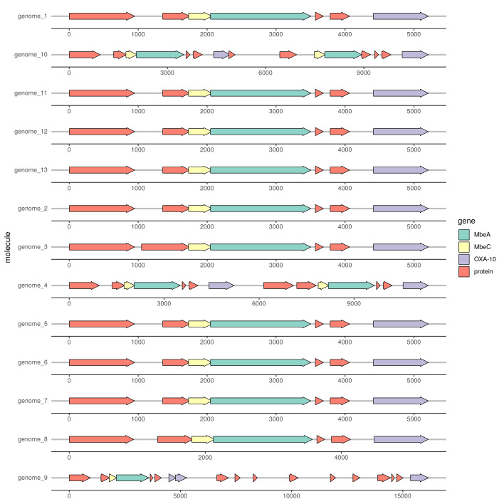
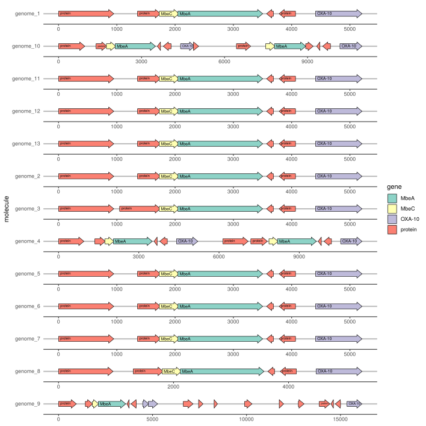

### Tutorial to visualize prokka output using gggenes package

Let us see how to visualize prokka data. Let's have **fun**.

I hope you already ran prokka on your genomes using following commands

```
% prokka genome.fasta --outdir prokka_out --prefix genome
```
If you have multiple genomes, you can loop prokka:

```
% for d in $(ls *.fasta);
  do 
  echo $d; prokka "$d" --outdir "$d"_prokka_out --prefix "$d" --centre X --compliant;
  done

```

####################----Updating this section on September 8th,2021:START----####################

#### Working with plasmids

I actually wanted to annotate the plasmids using prokka. But sometime specific gene plasmids are not readily avaible in prokka database. So, we need to turn on
the --proteins switch and provide the gbk file of the proteins we are interested to annotate in our plasmids.

Specifically, in my case, I want to annotate the betalactam resistant genes. For this, I use the betalactam from resfinder database available [here](https://bitbucket.org/genomicepidemiology/resfinder_db/src/master/beta-lactam.fsa).

After this, I extract all the NCBI accessions from the fasta file and download the gbk files for each of the betalactam gene like this:

```
grep '>' beta-lactam.fsa | grep -Po "_[A-Z].*" | sed 's/^_//g' >beta-lactam_accessions.list

time for i in $(cat beta-lactam_accessions.list | sed 's/:.*//g'); # it can be "time for i in CM004561 AY236073 AY034847;" if you know which genes you are dealing with
do 
  echo $i; 
  time curl -s  "https://eutils.ncbi.nlm.nih.gov/entrez/eutils/efetch.fcgi?db=nucleotide&id=${i}&rettype=gb&retmode=txt" >$i.gbk ; 
done
```

Previously we chose the closest plasmid. So, we combine all the gbk into one file to pass to prokka

```
cat CP068017.gbk *.gbk >Closest_Plasmid_AND_Carbapenem_ResGenes.gbk

time for d in $(ls *.fa); 
do 
  echo $d; 
  prokka "$d" --outdir "$d"_ClosePlasmid_ResGenes_prokka_out --prefix "$d" --centre X --compliant --proteins Closest_Plasmid_AND_Carbapenem_ResGenes.gbk; 
done

```
We can now clearly see the difference between the prokka annotation using default setting and prokka annotation using additional gbk files provided;

```
# Default settings without additional GBK files 

$ grep 'OXA' C1142_4_len_67445_circ_plasmid.fa_prokka_out/C1142_4_len_67445_circ_plasmid.fa.gff
gnl|X|JBPEFOOM_1	Prodigal:2.6	CDS	10356	11231	.	+	0	ID=JBPEFOOM_00011;Parent=JBPEFOOM_00011_gene;eC_number=3.5.2.6;Name=bla_1;gene=bla_1;inference=ab initio prediction:Prodigal:2.6,similar to AA sequence:UniProtKB:P13661;locus_tag=JBPEFOOM_00011;product=**Beta-lactamase OXA-1**;protein_id=gnl|X|JBPEFOOM_00011
gnl|X|JBPEFOOM_1	Prodigal:2.6	CDS	15650	16447	.	-	0	ID=JBPEFOOM_00017;Parent=JBPEFOOM_00017_gene;eC_number=3.5.2.6;Name=bla_2;gene=bla_2;inference=ab initio prediction:Prodigal:2.6,similar to AA sequence:UniProtKB:P14489;locus_tag=JBPEFOOM_00017;product=**Beta-lactamase OXA-10**;protein_id=gnl|X|JBPEFOOM_00017

# Default settings with additional GBK files 

$ grep 'OXA' C1142_4_len_67445_circ_plasmid.fa_ClosePlasmid_ResGenes_prokka_out/C1142_4_len_67445_circ_plasmid.fa.gff
gnl|X|JBPEFOOM_1	Prodigal:2.6	CDS	10356	11231	.	+	0	ID=JBPEFOOM_00011;Parent=JBPEFOOM_00011_gene;inference=ab initio prediction:Prodigal:2.6;locus_tag=JBPEFOOM_00011;note=**OXA-48**;product=hypothetical protein;protein_id=gnl|X|JBPEFOOM_00011
gnl|X|JBPEFOOM_1	Prodigal:2.6	CDS	15650	16447	.	-	0	ID=JBPEFOOM_00017;Parent=JBPEFOOM_00017_gene;inference=ab initio prediction:Prodigal:2.6;locus_tag=JBPEFOOM_00017;note=**OXA-48**;product=hypothetical protein;protein_id=gnl|X|JBPEFOOM_00017

```

####################----Updating this section on September 8th,2021:END----####################


make **gggenes** suitable format from prokka output

```
% grep "" */*.gff | fgrep 'CDS' \|
  awk '{print $1,$4,$5,$3,$7,$NF}' \|
  sed 's/;.*//g' \|
  sed 's/.fasta_prokka_out\/genome.*_1//g' \|
  sed -i 's/ + / 1 /g' \|
  sed -i 's/ - / -1 /g' >coordinates_files.gff

EDIT1: grep "" *.gff | fgrep 'CDS' | sed 's/;product/  product/' | sed 's/ /_/g' | awk '{print $1,$4,$5,$3,$7,$NF}' | fgrep -v 'hypothetical_protein' | sed 's/.*.gff://g' | sed 's/ + / 1 /g' | sed 's/ - / -1 /g' >coordinates_files.gff


```
Lets jump into **R** from here


```r
setwd("/home/datta/Desktop/CPE/ProkkaVis")
#getwd()
#files()
```

Let us load the **coordinates_files.gff** into a dataframe

```r
coords <- read.table("coordinates_files.gff",header = FALSE, sep = " ")
head(coords)
```

```
##          V1   V2   V3  V4 V5      V6
## 1 genome_10    1  948 CDS  1 protein
## 2 genome_10 1356 1748 CDS  1 protein
## 3 genome_10 1730 2068 CDS  1    MbeC
## 4 genome_10 2049 3503 CDS  1    MbeA
## 5 genome_10 3570 3686 CDS -1 protein
## 6 genome_10 3785 4066 CDS -1 protein
```

Let us add the headers for the dataframe 


```r
#names(coords) <- c("genome","start","end","source","frame","cds")
names(coords) <- c("molecule","start","end","source","direction","gene")
head(coords)
```

```
##    molecule start  end source direction    gene
## 1 genome_10     1  948    CDS         1 protein
## 2 genome_10  1356 1748    CDS         1 protein
## 3 genome_10  1730 2068    CDS         1    MbeC
## 4 genome_10  2049 3503    CDS         1    MbeA
## 5 genome_10  3570 3686    CDS        -1 protein
## 6 genome_10  3785 4066    CDS        -1 protein
```

```r
coords2 <- within(coords, rm(source))
coords2$strand[coords$direction=="1"] <- "forward"
coords2$strand[coords$direction=="-1"] <- "reverse"
head(coords2)
```

```
##    molecule start  end direction    gene  strand
## 1 genome_10     1  948         1 protein forward
## 2 genome_10  1356 1748         1 protein forward
## 3 genome_10  1730 2068         1    MbeC forward
## 4 genome_10  2049 3503         1    MbeA forward
## 5 genome_10  3570 3686        -1 protein reverse
## 6 genome_10  3785 4066        -1 protein reverse
```

Time to visualize. Lets load **gggenes** & **ggplot2** package

```r
library(gggenes)
library(ggplot2)
ggplot(subset(coords2, molecule == "genome_9"),
       aes(xmin = start, xmax = end, y = molecule, fill = gene, forward = direction)) +
  geom_gene_arrow()
```

<!-- -->

Lets now draw multiple genomes in the plot

```r
#head(coords)
p <- ggplot(coords2, aes(xmin = start, xmax = end, y = molecule, fill = gene)) 
p + geom_gene_arrow() + facet_wrap(~ molecule, scales = "free", ncol = 1) + scale_fill_brewer(palette = "Set3") +
  theme_classic(base_size = 3)
```

<!-- -->

But this does not look so elegant. And without the classic theme, there is constantly error call in R because of the size fonts.

```
Error in grid.Call(C_convert, x, as.integer(whatfrom), as.integer(whatto)...
```
So, we save the plot in a svg file using ggsave command


```r
q <- ggplot(coords2, aes(xmin = start, xmax = end, y = molecule, fill = gene)) +  geom_gene_arrow() + facet_wrap(~ molecule, scales = "free", ncol = 1) + scale_fill_brewer(palette = "Set3")

ggsave("pic1_gnome_warrows.svg", plot = q, device = svg, width = 250, height = 250, units = "mm", dpi=300)
#ggsave("pic1_gnome_warrows.png", plot = q, device = png, width = 2000, height = 2000, units = "mm", dpi=30)
#ggsave("pic1_gnome_warrows.jpeg", plot = q, device = jpeg, limitsize = FALSE)
```

The same above plots saved as svg file using ggsave generates a more elegant plot like this one below:


```r

```


## Beautifying the plot with theme_genes()
Because the resulting plot look a bit cluttered, a ‘ggplot2’ theme **theme_genes()** is provided with some sensible defaults.


```r
q2 <-  ggplot(coords2, aes(xmin = start, xmax = end, y = molecule, fill = gene)) +  geom_gene_arrow() + facet_wrap(~ molecule, scales = "free", ncol = 1) + scale_fill_brewer(palette = "Set3") + theme_genes()

ggsave("pic2_gnome_warrows_lessclutter.svg", plot = q2, device = svg, width = 250, height = 250, units = "mm", dpi=300)


```


### Aligning OXA-10 genes across facets using  make_alignment_dummies()

With that done, sometimes we need to vertically align a gene across the genomes. This could be easily achieved by make_alignment_dummies(). make_alignment_dummies() generates a set of ‘dummy’ genes that if added to the plot with ggplot2::geom_blank() will extend the range of each facet to visually align the selected gene across facets. Lets see how that works!


```r
dummies <- make_alignment_dummies(
  coords2,
  aes(xmin = start, xmax = end, y = molecule, id = gene),
  on = "OXA-10"
)

q3 <-  ggplot(coords2, aes(xmin = start, xmax = end, y = molecule, fill = gene)) +  geom_gene_arrow() + geom_blank(data = dummies) + facet_wrap(~ molecule, scales = "free", ncol = 1) + scale_fill_brewer(palette = "Set3") + theme_genes()

ggsave("pic3_gnomes_aligned_byGene.svg", plot = q2, device = svg, width = 250, height = 250, units = "mm", dpi=300)


```


### Labelling genes with geom_gene_label()

To label individual genes, let us provide a label aesthetic and use geom_gene_label(). 


```r
q4 <- ggplot(coords2, aes(xmin = start, xmax = end, y =molecule, fill = gene, label = gene)) +
  geom_gene_arrow(arrowhead_height = unit(5, "mm"), arrowhead_width = unit(3, "mm")) +
  geom_gene_label(align = "left") +
  geom_blank(data = dummies) +
  facet_wrap(~ molecule, scales = "free", ncol = 1) +
  scale_fill_brewer(palette = "Set3") +
  theme_genes()

ggsave("pic4_labelarrows_wgeneNames.svg", plot = q4, device = svg, width = 250, height = 250, units = "mm", dpi=300)

knitr::include_graphics("pic4_labelarrows_wgeneNames.svg")
```


Directionality to the gene arrows


```r
#head(coords2)
q5 <- ggplot(coords2, aes(xmin = start, xmax = end, y = molecule, fill = gene, label= gene, forward = direction)) +
  geom_gene_arrow(arrowhead_height = unit(5, "mm"), arrowhead_width = unit(3, "mm")) +
  geom_gene_label(align = "left") + facet_wrap(~ molecule, scales = "free", ncol = 1) +
  scale_fill_brewer(palette = "Set3") +
  theme_genes()

ggsave("pic5_labelarrows_wgeneNames_strand.svg", plot = q5, device = svg, width = 250, height = 250, units = "mm", dpi=300)


```


### Problems I encountered
1) loading the image in the html. So, I had to save the figures using ggsave in svg format. Specifically svg format because png, jpeg 's width & height even after increasing did not generate the required image format like svg image file

2) After generating, I have loaded the svg images using knitr::include_graphics. This works well if the output is knitr html. But for knitr pdf, this did not work. So, I was left with 0creating the html output option

3) To generate a pdf from html file, I used pandoc. This would generate a nice pdf in latex. But, the code and figure are cut off on the right side if excceeds the page width. So far, could not find fix for this.
